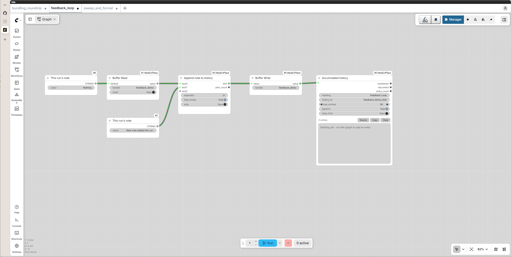
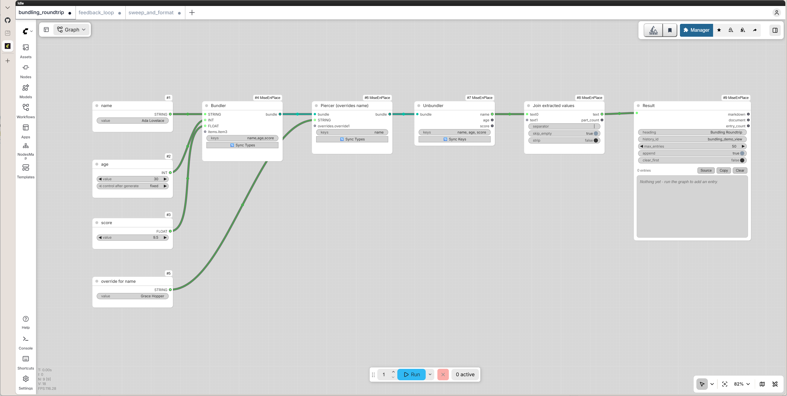
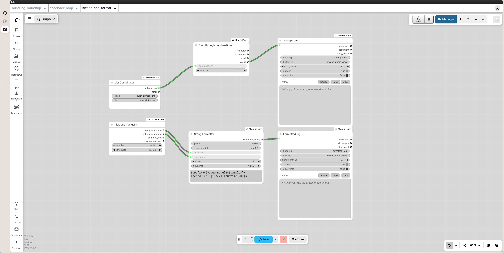

# Example workflows

Small, self-contained workflows that exercise a few nodes together - no
external services (no LoRA files, no llama.cpp server) required. Each is a
plain ComfyUI "API format" export.

To load one: drag the `.json` file onto the ComfyUI canvas, or use
**Workflow -> Open** and pick it. If your ComfyUI version treats it as an API
export and offers to convert it to an editable workflow, accept - the graph
is unchanged either way. They can also be POSTed directly to `/prompt` (wrap
in `{"prompt": <file contents>}`) for scripted use.

Each screenshot below has the same workflow embedded in its PNG metadata (the
way ComfyUI stamps its own output images), so dragging the screenshot itself
onto the canvas loads it too - no need to grab the `.json` separately.

- **feedback_loop.json** - Buffer Read/Buffer Write pair that accumulates a
  running note across separate queue runs via Text Concat, displayed by
  Markdown Viewer. Queue it more than once to see the history grow - that's
  the actual feedback loop, not something visible in a single run.

  

- **bundling_roundtrip.json** - packs three differently-typed values into a
  Bundler, overrides one of them with a Piercer, then pulls all three back
  out with an Unbundler.

  

- **sweep_and_format.json** - List Combinator + Sampler/Scheduler Looper
  stepping through a sampler/scheduler sweep, alongside Sampler & Scheduler
  Selector feeding a String Formatter for a one-off formatted tag. Both
  results land in the same Markdown Viewer history.

  
